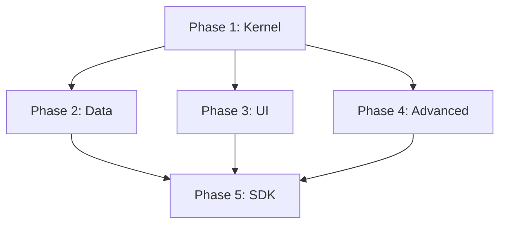

# Roadmap: PC Center OS (v3.0)

Этот план разбит на независимые фазы. Фазы 2, 3 и 4 могут выполняться параллельно после завершения Фазы 1.

---

## Фаза 1: Ультратонкое Ядро (Foundation)
*Цель: Запустить базовый брокер сигналов и эндпоинт API.*

*   [ ] Реализация `main.py` и базового FastAPI приложения.
*   [ ] Создание `Switchboard` и `Plugin Registry`.
*   [ ] Реализация Handshake Protocol (загрузчик плагинов).
*   [ ] Базовая Pydantic-валидация входящих сигналов.
*   [ ] **Milestone:** Ядро запускается и логгирует найденные плагины через Rich.

---

## Фаза 2: Системные Данные (Data Layer)
*Цель: Обеспечить хранение и индексацию файлов.*

*   [ ] Плагин **system_storage**: Интеграция LanceDB.
*   [ ] Плагин **system_fs**: Сканер диска на базе Watchdog.
*   [ ] Реализация Memory Mapping для обмена тяжелыми данными.
*   [ ] **Milestone:** Файлы на диске индексируются и доступны через API `storage.search`.

---

## Фаза 3: Интерфейс и Слоты (UI Layer)
*Цель: Создать визуальную оболочку и систему инъекций.*

*   [ ] **System Shell**: Базовый Svelte-шаблон с переключателем 5 столов.
*   [ ] **Grid Engine**: Реализация системы сетки и размещения элементов.
*   [ ] **Shortcut & Widget logic**: Рендеринг ярлыков и виджетов с учетом `grid_size`.
*   [ ] Реализация Slot Registry (Бэкенд + Фронтенд).
*   [ ] Настройка динамического импорта ES-модулей в Vite.
*   [ ] Локальная шина событий (`window.dispatchEvent`).
*   [ ] **Milestone:** Шелл загружается, позволяет переключать столы и отображать пустые ячейки сетки.

---

## Фаза 4: Наблюдаемость и Задачи (Advanced)
*Цель: Добавить трассировку и фоновую обработку.*

*   [ ] Плагин **system_executor**: Taskiq + воркеры.
*   [ ] Плагин **system_logger**: Трассировка сигналов и OpenTelemetry.
*   [ ] Реализация `correlation_id` и `trace_stack`.
*   [ ] **Milestone:** Можно запустить "тяжелую" задачу и увидеть её прогресс в графе сигналов.

---

## Фаза 5: SDK и Инспекция (DevExp)
*Цель: Сделать разработку плагинов максимально простой.*

*   [ ] Класс `BasePlugin` и декораторы `@capability`.
*   [ ] **System Inspector**: Визуальная карта слотов и сигналов.
*   [ ] Публикация Boilerplate (шаблона) нового плагина.
*   [ ] **Milestone:** Новый плагин пишется за 5 минут через наследование от SDK.

---

## Параллельность потоков (Non-blocking)

