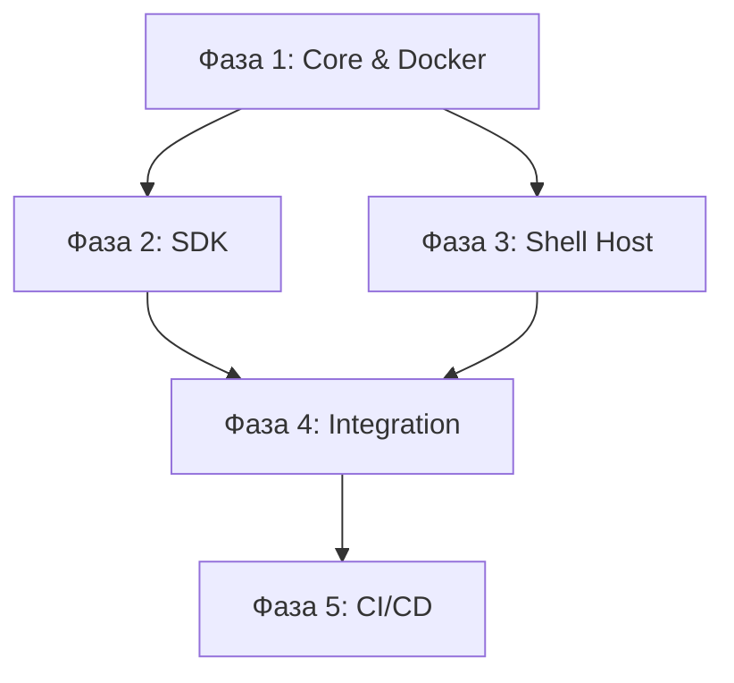

# Roadmap: Iteration 2 (Integration & Shell)

Этот документ отслеживает прогресс интеграции PC Center v3.0, фокусируясь на создании единого сервера и полноценного Шелла.

---

## Фаза 1: Ядро и инфраструктура раздачи (The Single-Server Core)
*Цель: Обеспечить работу FastAPI как единого сервера, раздающего статику Шелла и плагинов, а также поддерживающего API Брокера.*

*   [ ] **Настройка статических путей (`core/main.py`)**:
    *   [ ] Монтирование скомпилированного Шелла (`/desktop`).
    *   [ ] Динамическое монтирование плагинов (`/plugins/{id}/ui`) в цикле `lifespan`.
    *   [ ] Настройка CORS для локальной разработки.
    *   [ ] **CSP Middleware**: Настройка заголовков безопасности для предотвращения XSS.
*   [ ] **UI-Registry в Ядре**:
    *   [ ] **`core/registry.py`**: Добавить `register_ui_extension` и хранилище метаданных.
    *   [ ] **`core/loader.py`**: Парсинг секции `ui` из `manifest.json` и вызов регистрации.
    *   [ ] **Валидация Манифеста**: Реализовать JSON Schema валидацию перед загрузкой (защита от "White Screen").
    *   [ ] **Health Checks**: Эндпоинт для проверки наличия статических файлов плагина.
    *   [ ] **`core/main.py`**: Эндпоинт `GET /api/v1/registry/ui-extensions`.
*   [ ] **Docker-контейнеризация**:
    *   [ ] Dockerfile на базе `python-slim`.
    *   [ ] Multi-stage build (Svelte -> FastAPI).
*   [ ] **Milestone:** Сервер запускается, раздает статику Шелла и плагинов, API реестра работает и защищен CSP.

---

## Фаза 2: SDK и унифицированные настройки (The Plugin Contract)
*Цель: Создать стандарт, по которому плагин заявляет свои возможности и интерфейсы.

*   [ ] **Базовый класс BasePlugin (`core/sdk.py`)**:
    *   [ ] Метод `get_settings_model()` (Pydantic).
    *   [ ] Метод `get_ui_manifest()` (Программное объявление UI).
*   [ ] **Генератор схем настроек**:
    *   [ ] Автоматическое преобразование Pydantic -> JSON Schema.
*   [ ] **Декларация UI-элементов**:
    *   [ ] Поддержка полей `widgets`, `shortcuts`, `views` в манифесте.
    *   [ ] **Версионирование**: Проверка поля `compatibility_version` (блокировка несовместимых UI).
*   [ ] **Milestone:** Плагины могут описывать свой UI и настройки через код Python.

---

## Фаза 3: Разработка системного плагина Shell (The Host)
*Цель: Создать SPA-приложение, которое выступает в роли рабочего стола.*

*   [ ] **Архитектура Шелла (Svelte 5)**:
    *   [ ] Core Store (глобальное состояние).
    *   [ ] UI Manager (сохранение конфигурации).
    *   [ ] **Dev Mode**: Опция загрузки виджетов с локального сервера (`localhost:3000`) для отладки.
    *   [ ] **Error Boundary**: Компонент для перехвата ошибок в виджетах.
    *   [ ] **Skeleton Loading**: UI-плейсхолдеры при загрузке.
*   [ ] **Система рабочих столов**:
    *   [ ] Sidebar с навигацией.
    *   [ ] CRUD столов через Брокер.
    *   [ ] **Персистентность (State Persistence)**: Сохранение/загрузка состояния столов из БД (LanceDB/SQLite).
*   [ ] **Desktop Grid**:
    *   [ ] CSS Grid сетка.
    *   [ ] (Опционально) Drag-and-drop.
*   [ ] **Milestone:** Шелл отображает сетку, переключает столы и сохраняет их состояние в БД.

---

## Фаза 4: Интеграционные точки и менеджер контента
*Цель: Реализовать динамическое наполнение Шелла данными сторонних плагинов.*

*   [ ] **Top Bar Slot**:
    *   [ ] Сканирование и рендеринг `top_bar.item`.
*   [ ] **Диалог управления столом**:
    *   [ ] Модальное окно "Capabilities".
    *   [ ] Вкладки "Виджеты" и "Приложения".
*   [ ] **Widget Lifecycle**:
    *   [ ] Загрузка JS-бандлов виджетов.
    *   [ ] **Iframe Sandbox**: Реализация безопасной инъекции виджетов в iframe.
    *   [ ] **Context Bridge**: Передача токена и ID через `postMessage`.
*   [ ] **Milestone:** Пользователь может добавить виджет плагина на рабочий стол через безопасный UI.

---

## Фаза 5: Развертывание и CI/CD (The Testing Pipeline)
*Цель: Автоматизировать тестирование и развертывание на Hugging Face Spaces.*

*   [ ] **Dockerfile для HF**:
    *   [ ] Проброс порта 7860.
*   [ ] **GitHub Action**:
    *   [ ] Pipeline: Build UI -> Docker Build -> Push to HF Registry.
    *   [ ] **E2E Tests**: Интеграция Playwright для проверки UI перед деплоем.
*   [ ] **Metadata**:
    *   [ ] Обновление `README.md` (`sdk: docker`).
*   [ ] **Milestone:** Коммит в `main` автоматически тестируется и обновляет деплой на Hugging Face.

---

## Поток выполнения

