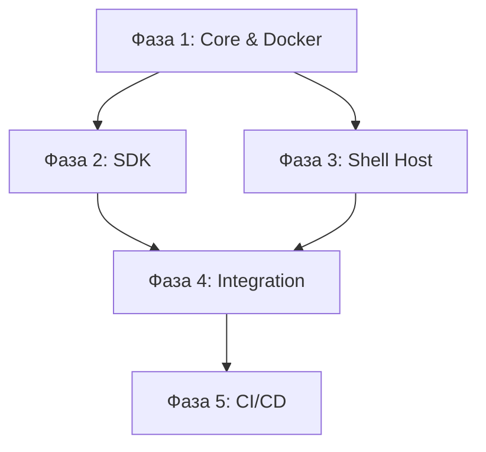

# Roadmap: Iteration 2 (Integration & Shell)

Этот документ отслеживает прогресс интеграции PC Center v3.0, фокусируясь на создании единого сервера и полноценного Шелла.

---

## Фаза 1: Ядро и инфраструктура раздачи (The Single-Server Core)
*Цель: Обеспечить работу FastAPI как единого сервера, раздающего статику Шелла и плагинов, а также поддерживающего API Брокера.*

*   [ ] **Настройка статических путей (`core/main.py`)**:
    *   [ ] Монтирование скомпилированного Шелла (`/desktop`).
    *   [ ] **WhiteNoise**: Внедрить middleware для кеширования и сжатия статики (production-ready).
    *   [ ] Динамическое монтирование плагинов (`/plugins/{id}/ui`) в цикле `lifespan`.
    *   [ ] Настройка CORS для локальной разработки.
    *   [ ] **CSP (Secure)**: Настройка заголовков безопасности с библиотекой `secure` или аналогом.
*   [ ] **UI-Registry в Ядре**:
    *   [ ] **`core/registry.py`**: Добавить `register_ui_extension` и хранилище метаданных.
    *   [ ] **`core/loader.py`**: Парсинг секции `ui` из `manifest.json`.
    *   [ ] **Валидация Манифеста (Pydantic)**: Использовать Pydantic для валидации схемы манифеста.
    *   [ ] **Health Checks**: Эндпоинт для проверки наличия статических файлов плагина.
    *   [ ] **`core/main.py`**: Эндпоинт `GET /api/v1/registry/ui-extensions`.
*   [ ] **Docker-контейнеризация**:
    *   [ ] Dockerfile на базе `python-slim`.
    *   [ ] Multi-stage build (Svelte -> FastAPI).
*   [ ] **Milestone:** Сервер запускается, эффективно раздает статику (WhiteNoise) и защищен (CSP).

---

## Фаза 2: SDK и унифицированные настройки (The Plugin Contract)
*Цель: Создать стандарт, по которому плагин заявляет свои возможности и интерфейсы.

*   [ ] **Базовый класс BasePlugin (`core/sdk.py`)**:
    *   [ ] Метод `get_settings_model()` (Pydantic).
    *   [ ] Метод `get_ui_manifest()` (Программное объявление UI).
*   [ ] **Генератор схем настроек**:
    *   [ ] Автоматическое преобразование Pydantic -> JSON Schema (`.model_json_schema()`).
*   [ ] **Декларация UI-элементов**:
    *   [ ] Поддержка полей `widgets`, `shortcuts`, `views` в манифесте.
    *   [ ] **Версионирование**: Проверка поля `compatibility_version`.
*   [ ] **Milestone:** Плагины могут описывать свой UI и настройки через код Python.

---

## Фаза 3: Разработка системного плагина Shell (The Host)
*Цель: Создать SPA-приложение, которое выступает в роли рабочего стола.*

*   [ ] **Архитектура Шелла (Svelte 5)**:
    *   [ ] **State Management (Runes)**: Использование нативных Runes (`$state`) для реактивности.
    *   [ ] **UI Manager**: Синхронизация состояния с localStorage/API.
    *   [ ] **Dev Mode**: Опция загрузки виджетов с локального сервера.
    *   [ ] **Error Boundary**: Компонент для перехвата ошибок в виджетах.
    *   [ ] **Skeleton Loading**: UI-плейсхолдеры.
*   [ ] **Система рабочих столов**:
    *   [ ] Sidebar с навигацией.
    *   [ ] CRUD столов через Брокер.
    *   [ ] **Персистентность (LanceDB/SQLite)**: Сохранение состояния столов в БД.
*   [ ] **Desktop Grid**:
    *   [ ] CSS Grid сетка (нативная).
    *   [ ] (Опционально) Drag-and-drop (`svelte-dnd-action`).
*   [ ] **Milestone:** Шелл отображает сетку, переключает столы и сохраняет их состояние.

---

## Фаза 4: Интеграционные точки и менеджер контента
*Цель: Реализовать динамическое наполнение Шелла данными сторонних плагинов.*

*   [ ] **Top Bar Slot**:
    *   [ ] Сканирование и рендеринг `top_bar.item`.
*   [ ] **Диалог управления столом**:
    *   [ ] Модальное окно "Capabilities".
    *   [ ] Вкладки "Виджеты" и "Приложения".
*   [ ] **Widget Lifecycle**:
    *   [ ] Загрузка JS-бандлов виджетов.
    *   [ ] **Iframe Sandbox**: Безопасная инъекция виджетов.
    *   [ ] **Penpal**: Настройка двустороннего общения (host <-> widget) через `penpal`.
*   [ ] **Milestone:** Пользователь может добавить виджет плагина на рабочий стол через безопасный UI.

---

## Фаза 5: Развертывание и CI/CD (The Testing Pipeline)
*Цель: Автоматизировать тестирование и развертывание на Hugging Face Spaces.*

*   [ ] **Dockerfile для HF**:
    *   [ ] Проброс порта `7860`.
*   [ ] **GitHub Action**:
    *   [ ] Pipeline: Build UI -> Docker Build -> Push to HF Registry.
    *   [ ] **Playwright**: Интеграция E2E тестов в пайплайн.
    *   [ ] **Caching**: Настройка кеширования (pnpm, playwright).
*   [ ] **Metadata**:
    *   [ ] Обновление `README.md` (`sdk: docker`).
*   [ ] **Milestone:** Коммит в `main` автоматически тестируется и обновляет деплой на Hugging Face.

---

## Поток выполнения

